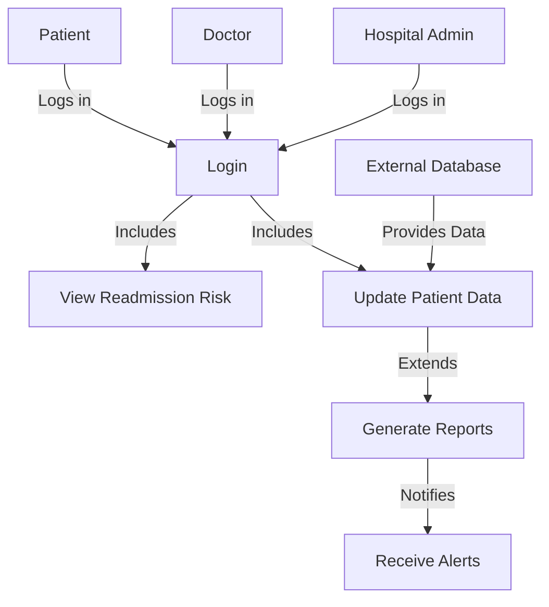
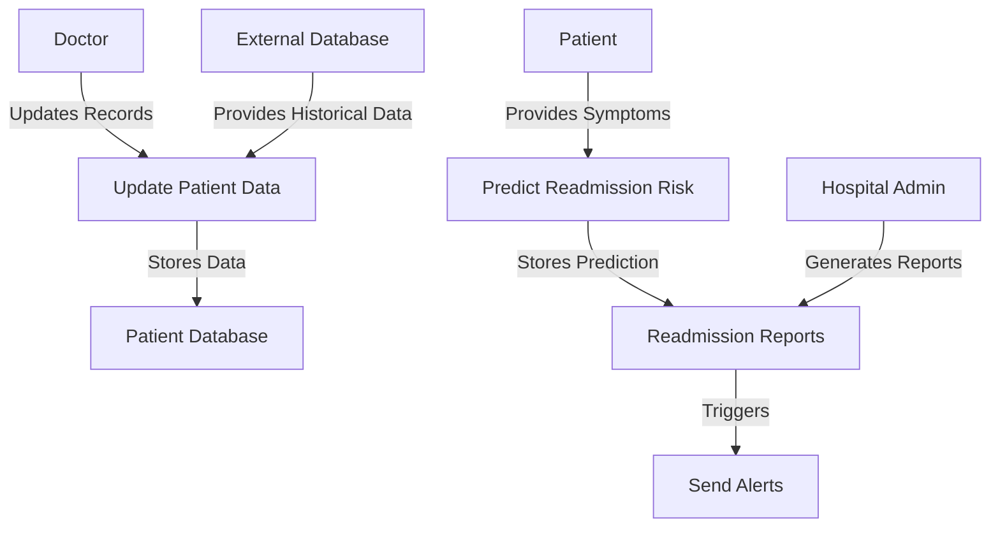
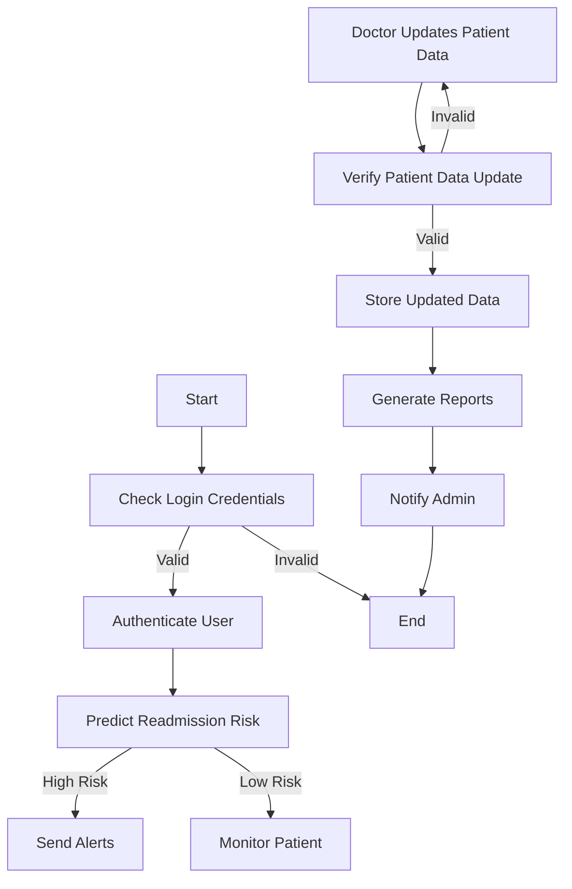

# Patient_Readmission_Tracker 

## Project Overview 
This project aims to develop a **patient readmission tracking and analysis system** to help hospitals **monitor patient records, predict readmission rates, and optimize resource allocation**. By analyzing patient data, we can identify high-risk patients and recommend interventions to reduce hospital readmissions.  

---

## Features
- **Patient Record Management**: Store and manage patient details securely.  
- **Readmission Prediction**: Predict the likelihood of a patient’s readmission using machine learning.  
- **Resource Allocation**: Help hospitals allocate beds, staff, and medical resources effectively.  
- **Data Visualization**: Generate insights through graphical reports and dashboards.  
- **Database Integration**: Store patient data efficiently using a robust database system.  

---

## Problem Statement  
Hospital readmissions are a significant burden on healthcare systems, leading to increased costs and reduced efficiency. The lack of a proper **tracking mechanism** makes it difficult for hospitals to:  
1. **Monitor patient records** systematically.  
2. **Identify high-risk patients** who are likely to be readmitted.  
3. **Optimize hospital resources** like beds, staff, and medication.  

This project provides a **data-driven approach** to **predict and analyze readmission rates**, allowing hospitals to improve patient care and reduce unnecessary readmissions.  

---

## 📌 Requirements Gathering and Planning  
### 1️⃣ **Understanding the Problem Statement**  
- Analyze the impact of hospital readmissions on costs and resource allocation.  
- Identify key factors contributing to patient readmissions.  
- Define project objectives: reducing readmission rates through predictive analytics.  

### 2️⃣ **Defining Project Scope**  
- **In-Scope:**  
  - Patient data analysis (e.g., demographics, medical history, previous admissions).  
  - Machine learning model to predict readmission risk.  
  - Data visualization for insights and trends.  
  - Resource optimization recommendations.  
- **Out of Scope:**  
  - Real-time hospital management system.  
  - Direct integration with electronic health records (EHR).  

### 3️⃣ **Gathering Data Requirements**  
- Identify datasets required (e.g., hospital records, patient history, diagnosis codes).  
- Ensure data privacy and compliance with regulations (e.g., HIPAA, GDPR).  
- Determine necessary preprocessing steps (handling missing data, normalization).  

### 4️⃣ **Technology Stack Selection**  
- **Programming Languages:** Python (Pandas, NumPy, Scikit-learn)  
- **Database:** SQL (for patient records storage and retrieval)  
- **Visualization Tools:** Matplotlib, Seaborn  
- **Machine Learning Models:** Logistic Regression, Decision Trees, Random Forest  
- **Deployment:** Flask/Django (Optional for API), Streamlit (for UI)  

### 5️⃣ **Defining Key Performance Indicators (KPIs)**  
- Readmission prediction accuracy (e.g., precision, recall, F1-score).  
- Reduction in readmission rates after model implementation.  
- Computation time and resource efficiency.  

### 6️⃣ **Project Timeline & Milestones**  
- **Week 1-2:** Data collection and preprocessing.  
- **Week 3-4:** Exploratory data analysis (EDA) and feature selection.  
- **Week 5-6:** Model development, training, and evaluation.  
- **Week 7-8:** Optimization, visualization, and documentation.  

### 7️⃣ **Risk Assessment and Mitigation**  
- **Data Quality Issues:** Missing values, outliers → Use imputation techniques.  
- **Overfitting of ML Models:** Implement cross-validation and feature engineering.  
- **Compliance & Privacy Risks:** Ensure anonymization and adhere to regulations.  

---

## 🔄 Data Preprocessing  
### 1️⃣ **Data Collection**  
- Gather patient records from hospital databases, public healthcare datasets, or simulated data.  
- Key features include:  
  **Demographics:** Age, gender, ethnicity  
  **Medical history:** Diagnoses, comorbidities, previous admissions  
  **Treatment details:** Medications, procedures, length of stay  
  **Hospital records:** Bed occupancy, discharge details, admission reasons  

### 2️⃣ **Handling Missing Data**  
- Identify missing values using `df.isnull().sum()`.  
- Strategies for missing data:  
  **Numerical features:** Impute using mean/median/mode.  
  **Categorical features:** Use mode or create an "Unknown" category.  
  **Drop rows/columns:** If missing data exceeds a threshold (e.g., 30%).  

### 3️⃣ **Data Cleaning**  
- Remove duplicate records.  
- Standardize column names for consistency.  
- Convert inconsistent data formats (e.g., date formats, categorical encoding).  

### 4️⃣ **Feature Engineering**  
- **Creating new features:**  
Calculate readmission gap (days between last discharge and readmission).  
Generate risk score based on past hospitalizations.  
- **Encoding categorical variables:**  
One-hot encoding for non-ordinal categories (e.g., gender, admission type).  
Label encoding for ordinal categories (e.g., severity levels).  
- **Scaling numerical data:**  
Apply Min-Max Scaling or Standardization (Z-score normalization).  

### 5️⃣ **Handling Outliers**  
- Use box plots and IQR method to detect extreme values.  
- Cap/floor extreme values or apply transformations (e.g., log transformation).  

### 6️⃣ **Splitting Data for Training and Testing**  
- Split dataset into training (80%) and testing (20%) sets using:  
  ```python
  from sklearn.model_selection import train_test_split
  X_train, X_test, y_train, y_test = train_test_split(X, y, test_size=0.2, random_state=42)
  ```
  
### 7️⃣ **Balancing the Dataset (If Needed)**  
- Check for class imbalance in readmission labels (`df['readmitted'].value_counts()`).  
- If imbalanced:  
  Use SMOTE (Synthetic Minority Over-sampling Technique).  
  Apply undersampling or oversampling methods.  

### 8️⃣ **Saving the Preprocessed Data**  
- Store the cleaned and processed dataset as a `.csv` file for reproducibility.  
- Example:  
  ```python
  df.to_csv("preprocessed_data.csv", index=False)
  ```

---

## **COCOMO Cost Estimation for Patient Readmission Tracker**  

The COCOMO model (Constructive Cost Model) is used to estimate the development effort, time, and cost for software projects based on the size of the codebase and complexity.  

### **COCOMO Model Formulae** 

1. *Effort (E) in Person-Months (PM):*  
   \[
   E = a(KLOC)^b
   \]  
2. *Development Time (T) in Months:*  
   \[
   T = c(E)^d
   \]  
3. *Total Cost Estimation:*  
   \[
   \text{Total Cost} = E \times \text{Average Developer Salary per Month}
   \]  

### **Estimation Parameters** 

| Parameter               | Value |
|-------------------------|----------------|
| Estimated Lines of Code (LOC) | *10,000 (10 KLOC)* |
| Development Mode | *Semi-Detached* |
| Effort Multiplier Constants (Semi-Detached Mode) | *a = 3.0, b = 1.12, c = 2.5, d = 0.35* |
| Average Developer Salary | *$5,000 per month* |

### **Cost Breakdown**

1. Effort Estimation: 
   \[
   E = 3.0 \times (10)^{1.12} = 3.0 \times 13.18 \approx 39.54 \text{ Person-Months}
   \]

2. Development Time Estimation: 
   \[
   T = 2.5 \times (39.54)^{0.35} = 2.5 \times 4.41 \approx 11.02 \text{ Months}
   \]

3. Total Cost Estimation:  
   \[
   \text{Total Cost} = 39.54 \times 5000 = 197,700 \text{ USD}
   \]

---

### **Factors Contributing to Cost**  

1. Project Complexity  
   - The *semi-detached* model assumes moderate complexity, with a mix of well-defined and evolving requirements.  
   
2. Machine Learning Model Development 
   - Requires *data preprocessing, model training, and validation* to predict patient readmission risks accurately.  

3. Database Integration  
   - Secure storage and efficient retrieval of patient records require a *robust database system*.  

4. Data Visualization & Reporting 
   - Graphical dashboards for insights add to the *development and testing efforts*.  

5. Testing & Deployment 
   - Ensuring accuracy in predictions, secure data handling, and real-world usability contributes to *time and cost*.  

---

### **Final Estimation Summary**  

| Metric | Estimated Value |
|--------|----------------|
| *Effort Required* | ~39.54 Person-Months |
| *Development Time* | ~11.02 Months |
| *Total Estimated Cost* | *~$197,700* |

This estimation provides an overview of the development effort and cost required for the *Patient Readmission Tracking Model*, considering machine learning, database integration, and visualization complexities.  

---
## 📅 **Scheduling the Project using a Gantt Chart**
A Gantt Chart helps plan the project timeline from **March 2025 - May 2025**, covering:
- Task identification
- Resource allocation
- Milestone tracking
- Deadline management

---

## 📌 **Project Timeline (March 2025 - May 2025)**
The **Gantt Chart** ensures efficient project execution by mapping key tasks over time.

| Task                  | March 2025 | April 2025 | May 2025 |
|-----------------------|-----------|------------|----------|
| System Design        | ✅        |            |          |
| UML Diagram Creation | ✅        |            |          |
| Database Setup       | ✅        | ✅         |          |
| Feature Development  |           | ✅         | ✅       |
| Report Generation    |           | ✅         | ✅       |
| Testing & Deployment |           |            | ✅       |

---
## **UML Use Case Diagram**
### 1️⃣ **Use Case Diagrams**
Use Case Diagrams provide a **graphical overview** of the system’s functionalities, illustrating actors, interactions, and system use cases.

### 2️⃣ **Actors in the System**
- **Primary Actor:**
  - **Patient**: Interacts with the system to view readmission risk.
  - **Doctor**: Updates patient data and assesses readmission risk.
  - **Hospital Admin**: Generates reports and manages alerts.
  
- **Supporting Actor:**
  - **External Database**: Supplies historical patient data.

### 3️⃣ **Use Cases**
- **Login**: Authentication for doctors, patients, and admins.
- **View Readmission Risk**: Predicts the likelihood of readmission.
- **Update Patient Data**: Doctors update patient records.
- **Generate Reports**: Admin generates detailed patient readmission reports.
- **Receive Alerts**: System notifies stakeholders about high-risk patients.

### 4️⃣ **Use Case Relationships**
- **Include Relationship**: 
  - "View Readmission Risk" ➝ Includes ➝ "Login"*
  - "Update Patient Data" ➝ Includes ➝ "Login"
- **Extend Relationship**:
  - "Generate Reports" ➝ Extends ➝ "Update Patient Data"
 
  ## UML Use Case Diagram



## Data Flow Diagram (DFD)



## Control Flow Diagram (CFD)




---
# Patient Readmission Tracker System

## UML Class Diagram

```mermaid
classDiagram
    class Patient {
        +int patientID
        +string name
        +int age
        +string gender
        +string medicalHistory
        +string contactDetails
        +viewMedicalHistory()
        +updateDetails()
    }

    class Hospital {
        +int hospitalID
        +string name
        +string location
        +int capacity
        +admitPatient()
        +dischargePatient()
    }

    class AdmissionRecord {
        +int recordID
        +int patientID
        +string admissionDate
        +string dischargeDate
        +string diagnosis
        +string treatment
        +addAdmissionRecord()
        +updateRecord()
        +fetchRecords()
    }

    class ReadmissionAnalysis {
        +int analysisID
        +int patientID
        +float readmissionRisk
        +string riskFactors
        +float predictedCost
        +analyzeReadmissionRisk()
        +generateReport()
    }

    class Doctor {
        +int doctorID
        +string name
        +string specialization
        +int experience
        +assignTreatment()
        +consultPatient()
    }

    class Billing {
        +int billID
        +int patientID
        +float totalCost
        +string insuranceDetails
        +generateBill()
        +processPayment()
    }

    %% Relationships
    Patient "1" --o "many" AdmissionRecord : has
    Patient "1" --o "1" ReadmissionAnalysis : analyzedBy
    Patient "1" --o "many" Billing : billedFor
    Patient "1" --o "1" Hospital : admittedTo
    Hospital "1" o-- "many" Doctor : employs
    Hospital "1" o-- "many" AdmissionRecord : maintains
    AdmissionRecord "1" *-- "1" Patient : belongsTo
    Doctor <|-- Surgeon
    Doctor <|-- Physician


